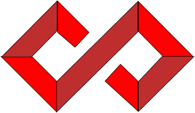

<h1 align="center">
  
</h1>

<h4 align="center">
  Inovart
</h4>

  
  
  
  
  
  
  
  
  

  <a href="#-tecnologias">Tecnologias</a>&nbsp;&nbsp;&nbsp;|&nbsp;&nbsp;&nbsp;
  <a href="#-projeto">Projeto</a>

 

<!-- 

  
</a> -->

## 🚀 Tecnologias

Esse projeto foi desenvolvido com as seguintes tecnologias:

- [Node.js](https://nodejs.org/en/)
- [Nunjucks](https://mozilla.github.io/nunjucks/)

## 💻 Projeto

A Inovart é uma projeto densevolvido para empresas que trabalham com designer e artes feitas com porcelanatos, empresas que buscam vender seus produtos através de um site.

---

